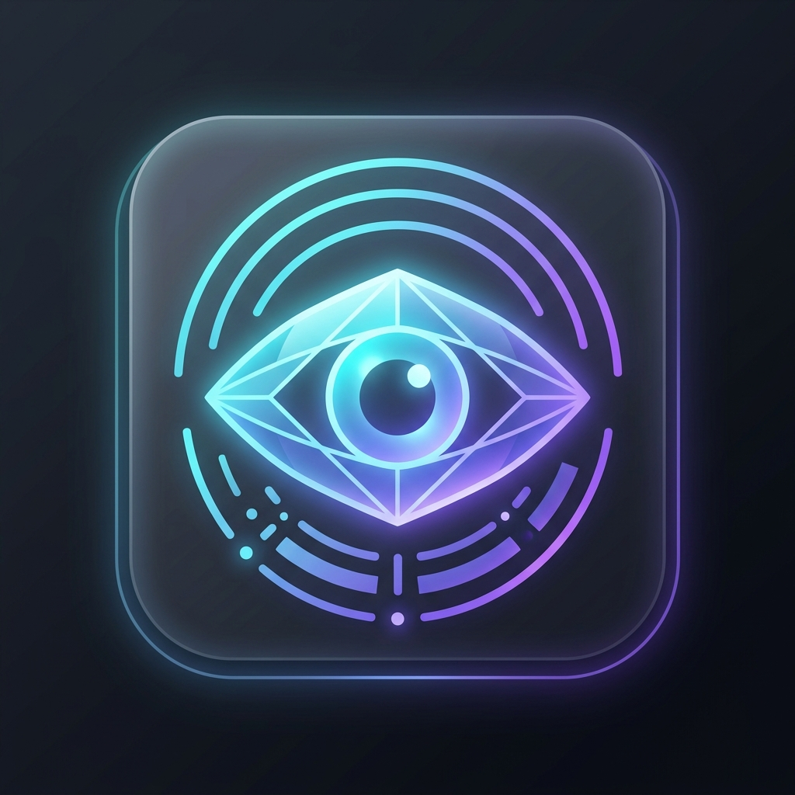

# Adrishya

<p align="center">
  
</p>

**Adrishya** is a cross-platform desktop AI assistant overlay built using Electron, React, TypeScript, and Tailwind CSS. It serves as a fully functional, private overlay that listens to conversations, reads screen contents using local OCR, and provides contextual AI suggestions. 

Designed for privacy, **Adrishya is completely invisible during screen-sharing sessions** (e.g., Zoom, Teams, Discord, Google Meet) utilizing native OS window protection.

---

## 🌟 Key Features

- **🛡️ Screen Share Protection (Invisibility)**: Uses native hardware-accelerated Content Protection (`win.setContentProtection(true)`), causing the window to appear completely black or disappear in stream recording/screen sharing.
- **✨ Frosted Glass UI (Glassmorphism)**: Beautiful semi-transparent window utilizing Windows 11 native **Acrylic** material and macOS native **Vibrancy** effects.
- **🔍 Private Local OCR**: Captures screen buffers and extracts code, questions, or text locally using a background WebAssembly `tesseract.js` process.
- **🎙️ Speech Transcription**: Continuous voice transcription using Chromium's Web Speech API (Free) or OpenAI/Groq Whisper APIs (for sub-second latency and multi-language support).
- **🚀 Collapsible overlay widget**: Drag the header anywhere using frameless dragging. Collapse it into a minimal floating horizontal pill to minimize distraction.
- **⚙️ Multi-Provider Support**: Configure API keys and models for **Google Gemini**, **OpenAI GPT**, **Anthropic Claude**, **Groq**, and **xAI Grok** on the fly.

---

## 📖 In-Depth Specification
For a comprehensive architectural breakdown, process diagram, system demerits/limitations, and detailed specification, please refer to the [Technical Specification Document (doc.md)](file:///d:/Projects/adrishya/doc.md).

---

## 🛠️ Project Setup & Installation

### Prerequisites
- **Node.js**: v18.x / v20.x or higher
- **npm**: v9.x or higher

### 1. Installation
Clone the repository and install all dependencies:
```bash
git clone https://github.com/IamJayPrakash/adrishya.git
cd adrishya
npm install
```

### 2. Running in Development
Start the Vite dev server and launch Electron:
```bash
npm run dev
```

### 3. Compiling and Building Distribution Executables
Compile and package binaries locally for your target OS:
```bash
# Package for Windows (.exe)
npm run build:win

# Package for macOS (.dmg, .zip)
npm run build:mac

# Package for Linux (.AppImage, .deb)
npm run build:linux
```
Output files will be generated in the `dist/` or `out/` folder.

---

## ⌨️ Global Hotkeys

Adrishya registers global shortcuts at the operating system level, allowing you to control the app even when focusing on full-screen exams, coding editors, or browsers:

| Shortcut | Action | Description |
| :--- | :--- | :--- |
| **`Ctrl + Shift + A`** | Toggle Visibility | Instantly hide or show the Adrishya overlay window. |
| **`Ctrl + Shift + V`** | Toggle Recording | Start or stop the microphone transcription recorder. |

---

## 👤 User Guide

### 1. AI Provider Setup
1. Launch the application.
2. Navigate to the **Settings** tab.
3. Select your desired active AI provider from the dropdown.
4. Input your API key (your key is saved securely in LocalStorage on your machine).
5. (Optional) Choose the default model name (e.g., `gemini-1.5-flash` or `gpt-4o-mini`).
6. Click **Save Settings**.

### 2. Customizing Interface Aesthetics
- **Opacity**: Adjust the opacity slider in the settings tab to make the glass overlay more or less translucent.
- **Font Size**: Scale message text size from `11px` to `18px` using the font size slider.
- **Themes**: Switch between:
  - **Light**: Frosted glass light theme.
  - **Dark**: Translucent frosted dark theme (Default).
  - **AMOLED**: Deep dark layout, perfect for OLED screens.

### 3. Using Screen OCR
1. Move the overlay so it doesn't obstruct the text you want to scan.
2. Click the **Screen** tab, then click **Capture Screen**.
3. Review the extracted text in the code editor box.
4. Click **Explain Code** or **Solve / Answer** to automatically submit the text along with prompt guidelines to your configured AI assistant.

### 4. Using Continuous Voice Mode
1. Click the **Voice** tab.
2. Ensure you have configured a Groq or OpenAI key if using Whisper API mode (Local Engine requires no keys).
3. Click **Start Voice** (or press `Ctrl+Shift+V` globally).
4. Speak; your transcript will roll onto the screen in real-time, and you can submit questions directly.

---

## 🤝 Contributing
Contributions are welcome! Please check out [CONTRIBUTING.md](file:///d:/Projects/adrishya/CONTRIBUTING.md) for local environment setup guidelines and pull request instructions.

## 📄 License
This project is open-source and licensed under the [MIT License](file:///d:/Projects/adrishya/LICENSE).
