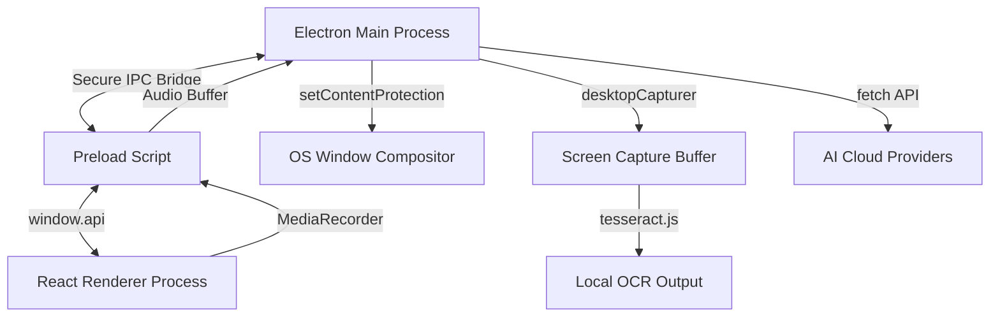

# Adrishya Technical Specification & Documentation

**Adrishya** (Sanskrit for *invisible* or *unseen*) is a production-grade, cross-platform desktop AI assistant overlay. Designed as a private utility, it provides frosted glass overlay interfaces that float over applications (including full-screen environments) while remaining completely invisible during screen-sharing sessions (such as Zoom, Discord, Google Meet, or Teams).

---

## 1. Application Overview & Architecture

Adrishya is built using a single-codebase **Electron + React + TypeScript + Tailwind CSS** architecture, managed via the **Vite** bundler.

### Process Separation:
1. **Main Process (`src/main/`)**:
   - Manages OS-level APIs, frameless windows, and window materials.
   - Listens to global hotkeys (`Ctrl+Shift+A` and `Ctrl+Shift+V`).
   - Executes screen capture buffers and runs Tesseract OCR locally (preventing UI thread blockages).
   - Manages secure external network requests to AI completions and transcription APIs (bypassing browser CORS restrictions).
2. **Preload Script (`src/preload/`)**:
   - Establishes a strict context-isolated bridge (`contextBridge`) exposing only designated methods to `window.api`.
3. **Renderer Process (`src/renderer/`)**:
   - Implements the state machine for keys, visual styles, and conversational interactions.
   - Handles microphone capture via the browser Web Audio & MediaRecorder APIs.

---

## 2. Key Features

### 🪟 Private Glassmorphism Overlay
- **Frosted Blur Effect**: Utilizes native OS visual effects (`backgroundMaterial: 'acrylic'` on Windows 11 and `vibrancy: 'fullscreen-ui'` on macOS) coupled with Tailwind CSS backdrop filters.
- **Frameless Dragging**: Integrated `-webkit-app-region: drag` header with clickable button overrides (`-webkit-app-region: no-drag`).
- **Collapsible Widget**: Instantly switches between a full interactive dashboard (`380px` x `600px`) and a compact pill widget (`320px` x `75px`) to minimize visual distraction.

### 🛡️ Screen Sharing Invisibility
- Uses Electron's native `BrowserWindow.setContentProtection(true)`. 
- Tells the operating system's window manager to exclude this specific window handles from screenshots, captures, and screen-sharing recordings. Other attendees see a black rectangle or empty space where the widget sits.

### 🎙️ Continuous Voice Transcription
- **Local Mode**: Uses Chromium's Web Speech API (`webkitSpeechRecognition`) for continuous offline/built-in transcription at zero cost.
- **API Mode**: Uses `MediaRecorder` to record audio chunks and transcribes them via Groq's or OpenAI's Whisper API. Groq Whisper is prioritized as the default due to its sub-second latency and cost-effectiveness.

### 🔍 Screen Awareness & OCR
- Captures high-definition screen buffers (`1920x1080`) using `desktopCapturer`.
- Automatically executes local OCR using Tesseract WebAssembly in the background process.
- Features preset analysis triggers like "Explain Code" or "Solve / Answer" which immediately feed the extracted text to the AI model.

---

## 3. Supported AI Providers & Default Models

Adrishya includes native endpoints for the major AI providers. Users can choose their preferred model and input their API keys directly via the Settings Panel:

| Provider | Default Model | Custom Models Supported |
| :--- | :--- | :--- |
| **Google Gemini** | `gemini-1.5-flash` | `gemini-1.5-pro`, `gemini-2.0-flash` |
| **OpenAI GPT** | `gpt-4o-mini` | `gpt-4o`, `gpt-3.5-turbo` |
| **Anthropic Claude** | `claude-3-5-sonnet-20241022` | `claude-3-5-haiku`, `claude-3-opus` |
| **Groq (Llama-3)** | `llama3-70b-8192` | `llama3-8b`, `mixtral-8x7b` |
| **xAI Grok** | `grok-2-1212` | `grok-beta` |

---

## 4. System Limitations & Demerits

While Adrishya is highly optimized, developers and users should be aware of the following demerits:

1. **macOS Screen Protection Bypass**:
   - On macOS, some WebRTC-based sharing systems (like web browser Google Meet in Chrome) capture raw desktop screens at a lower compositor level and may occasionally show a outline of the protected window. It is fully hidden on Zoom/Discord and Windows machines.
2. **First-Launch OCR Download**:
   - Tesseract.js runs local WebAssembly. On its first initialization, it downloads the English language pack (`eng.traineddata`, ~4MB) and Wasm core scripts from CDNs. Once downloaded, it caches them and operates **100% offline**.
3. **Continuous Voice API Token Consumption**:
   - Running continuous transcription in Whisper API Mode sends chunked audio files (~7 seconds each) to Groq/OpenAI. While highly accurate, this consumes API tokens and requires an active internet connection.
4. **CORS Restrictions in DevTools**:
   - Opening Electron DevTools might temporarily disable transparency or vibrancy on certain platforms due to window repaint policies in Chromium.

---

## 5. Known Behaviors & Troubleshooting

- **Overlay Closes or Disappears**:
  - The app is registered to sit on top of all windows (`alwaysOnTop: true`). On Windows, certain admin-run full-screen games or applications might forcefully take focus. Toggle visibility with `Ctrl+Shift+A` to bring it back.
- **Microphone Access Fails**:
  - Ensure the application has OS-level microphone permissions. On macOS (10.15+), macOS system settings must authorize the app bundle.
